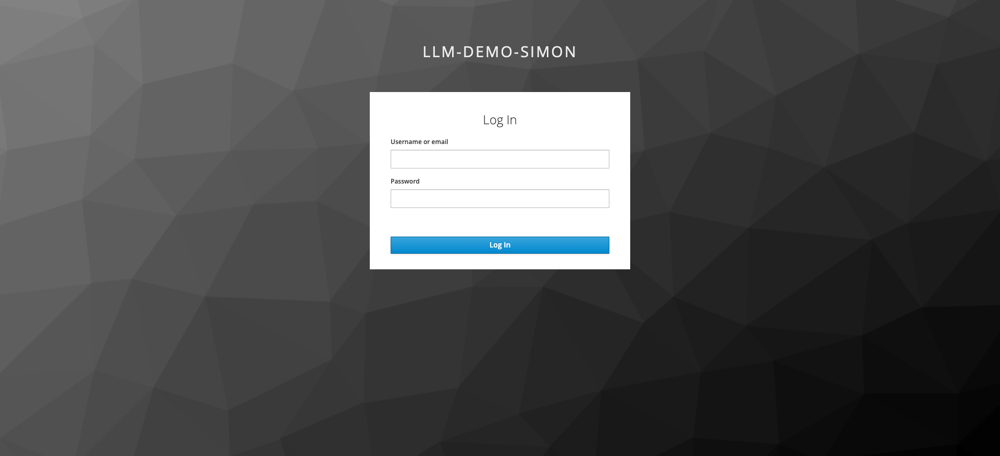
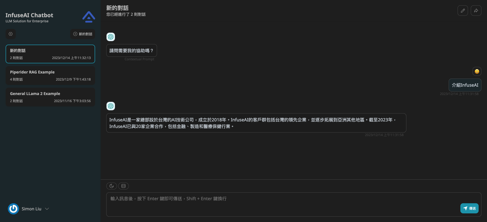
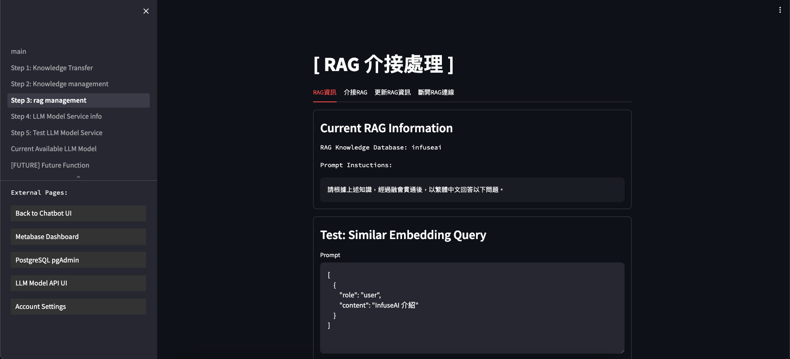
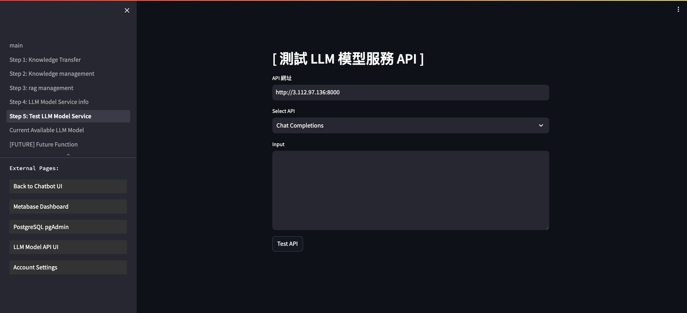
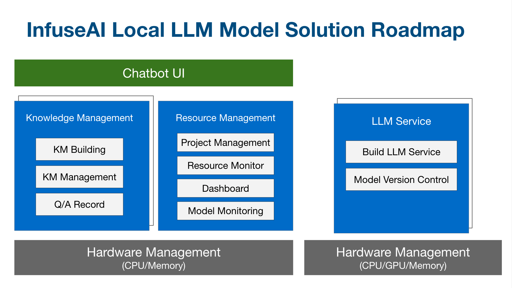
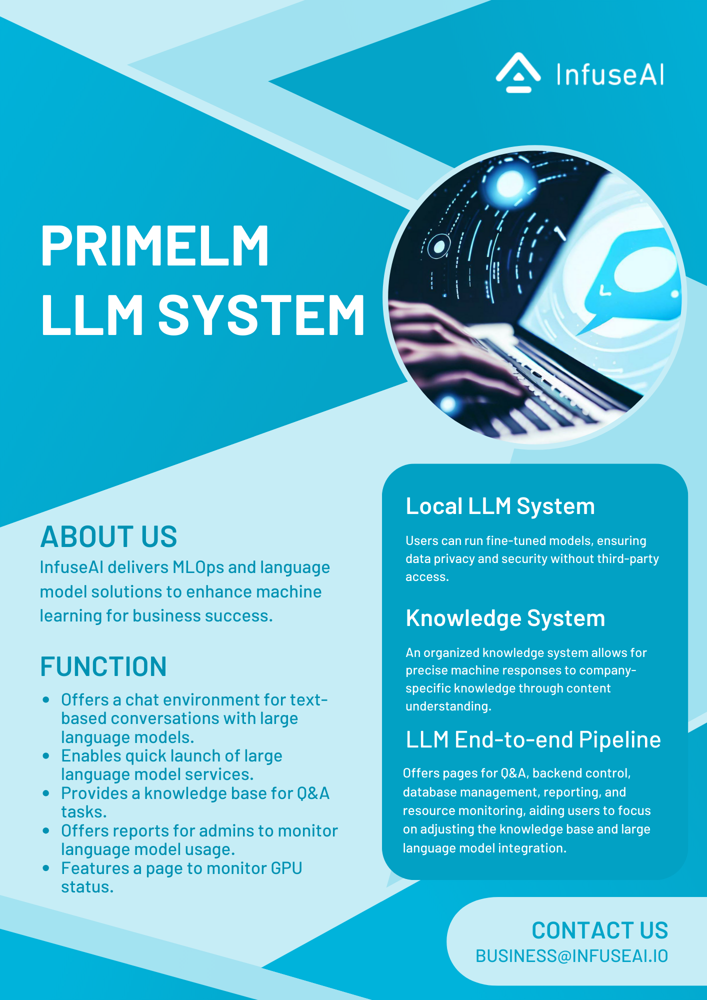

# PrimeLM

中文版本: 請點選 [中文版本](../README.md)

(Note: This product will be revised and updated here as needed based on relevant requirements.)

## Introduction

The large language model service and project dialogue system platform, built for enterprises, is provided by InfuseAI.

|Account Management|Chatbot UI Interface|
|-----|-----|
|||

|Knowledge Database|Testing LLM Model API|
|-----|-----|
|||

## Why we use PrimeLM?

To assist businesses in quickly and effectively implementing large language models, this application focuses on the following key areas:

1. Corporate Confidential Data Leakage and Security Issues: Due to the company's risk assessment, certain large language models cannot be adopted, thereby increasing the challenges in integrating these models.
2. Model's Ability to Learn Internal Knowledge: Given the extensive knowledge base documents within the company, exploring how to effectively enable the model to rapidly assimilate this knowledge is key.
3. The Possibility of Continuously Improving the Model: If large language models are not periodically updated, they may encounter unsolvable problems, making it crucial to ensure the model's continual advancement.
4. Project Management of Large Language Models: As enterprises gradually integrate various projects involving LLMs into their daily work environment, effective management of knowledge bases and models, as well as project permissions and account control, become increasingly important.

## III. Product Roadmap

## IV. 平台目前支援的模型

- OpenAI API Service:

  The platform supports the OpenAI API Service, including:

  1. OpenAI API Service
  2. Azure OpenAI API Service (AOAI)

- LlaMa GGUF Model:

  The platform supports service initiation and usage in the GGUF model format.

- Traditional Chinese Llama GGUF Model:

  The platform has confirmed the following list of available Traditional Chinese Llama models for use:

| Model Name               | Author                                                    | HuggingFace Repo                                                                                                      |
|--------------------------|-----------------------------------------------------------|-----------------------------------------------------------------------------------------------------------------------|
| Taiwan-LLaMa-v1.0        | NTU Yun-Nung Chen Lab, Lin Yen-Ting                      | [yentinglin/Taiwan-LLaMa-v1.0](https://huggingface.co/yentinglin/Taiwan-LLaMa-v1.0)                                   |
| Taiwan-LLM-7B-v2.1-chat  | NTU Yun-Nung Chen Lab, Lin Yen-Ting   Ubitus | [yentinglin/Taiwan-LLM-7B-v2.1-chat](https://huggingface.co/yentinglin/Taiwan-LLM-7B-v2.1-chat)                       |
| Taiwan-LLM-13B-v2.0-chat | NTU Yun-Nung Chen Lab, Lin Yen-Ting   Ubitus | [yentinglin/Taiwan-LLM-13B-v2.0-chat](https://huggingface.co/yentinglin/Taiwan-LLM-13B-v2.0-chat)                     |
| Mistral-7B-v0.1          | Mistral AI Team                                           | [mistralai/Mistral-7B-v0.1](https://huggingface.co/mistralai/Mistral-7B-v0.1)                                         |
| TAIDE-7B-b.11.0.0       | National Science and Technology Council(NSTC)                                                    | [TAIDE Official Website](https://taide.tw/)   (Note: Currently Not yet publicly released. InfuseAI has collaborated with the National Science Council to confirm the usage and integration methods of the model.) |

## V. Knowledge Base Support Method

- Knowledge can be imported via CSV files, converted into Embedding Vectors, and stored in the pgvector Database for operational storage.
- Subsequently, more knowledge databases will be integrated according to customer demand.

## VI. Contact Method for Product Use

- [ Method 1 ] Write down your requirements and send them to InfuseAI Business E-mail: business@infuseai.io
- [ Method 2 ] Fill out the following form, and a specialist will contact you: 

#TODO: form generation

## VII. Product Flyer

