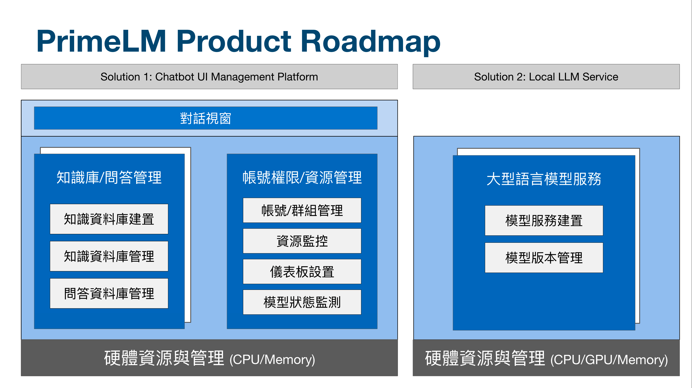

# PrimeLM

（備註：此產品會因相關需求，隨時進行修正，並且更新於此。）

## I. 平台介紹

為企業所打造的大型語言模型服務與專案對話系統平台，本系統由 InfuseAI 提供服務。

## II. 為何要使用 PrimeLM 成為企業內部的 LLM 管理系統?

為了協助企業迅速且有效地導入大型語言模型，本應用著重於以下幾個關鍵領域：

1. 企業機密資料外洩與資安問題：鑒於公司的風險評估，無法採用某些大型語言模型，從而增加了整合這些模型的挑戰。
2. 模型學習內部知識的能力：考慮到公司內部擁有豐富的知識庫文件，探索如何有效地使模型快速吸收這些知識成為關鍵。
3. 持續改進模型的可能性：如果不定期更新大型語言模型，可能會遇到無法解答的問題，因此確保模型的持續進步變得至關重要。
4. 大型語言模型的專案管理：隨著企業逐步在日常工作環境中整合LLM的不同專案，針對知識庫和模型的管理、專案權限和帳號的有效控制變得尤為重要。

## III. 產品 Roadmap

## IV. 平台目前支援的模型

- OpenAI API Service: 

  本平台支援 OpenAI API Service，包含：

  1. OpenAI API Service
  2. Azure OpenAI API Service (AOAI)

- LlaMa GGUF 模型：

  本平台支援[GGUF模型](https://huggingface.co/models?search=gguf)格式進行服務啟動與使用

- 繁體中文 Llama GGUF 模型：

  本平台確認可使用的繁體中文 Llama 模型整理如下：

| Model Name               | Author                                                    | HuggingFace Repo                                                                                                      |
|--------------------------|-----------------------------------------------------------|-----------------------------------------------------------------------------------------------------------------------|
| Taiwan-LLaMa-v1.0        | 台大陳縕儂實驗室 林彥廷博士生候選人                       | [yentinglin/Taiwan-LLaMa-v1.0](https://huggingface.co/yentinglin/Taiwan-LLaMa-v1.0)                                   |
| Taiwan-LLM-7B-v2.1-chat  | 台大陳縕儂實驗室 林彥廷博士生候選人   優必達株式會社 Ubitus | [yentinglin/Taiwan-LLM-7B-v2.1-chat](https://huggingface.co/yentinglin/Taiwan-LLM-7B-v2.1-chat)                       |
| Taiwan-LLM-13B-v2.0-chat | 台大陳縕儂實驗室 林彥廷博士生候選人   優必達株式會社 Ubitus | [yentinglin/Taiwan-LLM-13B-v2.0-chat](https://huggingface.co/yentinglin/Taiwan-LLM-13B-v2.0-chat)                     |
| Mistral-7B-v0.1          | Mistral AI Team                                           | [mistralai/Mistral-7B-v0.1](https://huggingface.co/mistralai/Mistral-7B-v0.1)                                         |
| TAIDE-13B-b.11.0.0       | 國科會                                                    | [taide/b.11.0.0](https://huggingface.co/taide/b.11.0.0)   備註：尚未公開，InfuseAI 已與國科會進行合作，確認模型使用與串接方式 |

## V. 知識庫支援方式

- 可透過 CSV 檔案匯入轉換成 Embedding Vector，並且存放到 [pgvector Database](https://github.com/pgvector/pgvector) 來進行存放作業。
- 後續會根據客戶需求，來導入更多的知識庫。

## VI. 產品使用聯絡方式

- [ 方法 1 ] 將相關需求撰寫，並且寄送至 InfuseAI Business E-mail: [business@infuseai.io](mailto:user@example.com)
- [ 方法 2 ] 填寫以下表單，將由專人與您聯絡：

  #TODO: form generation

## VII. 產品傳單

